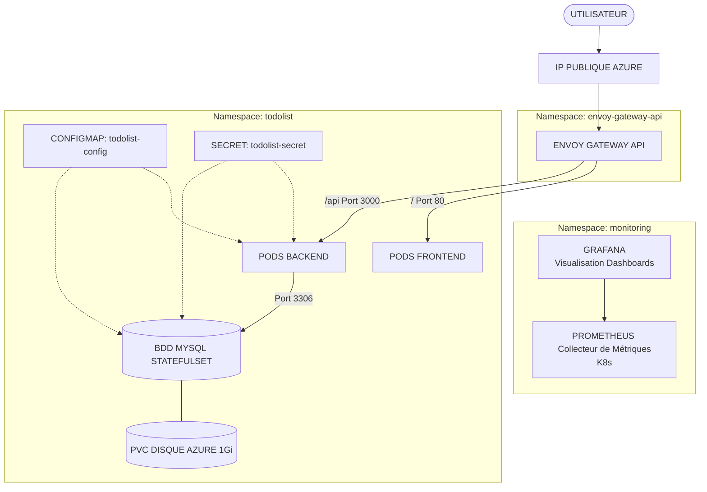

# Déploiement de l'application ToDoList sur un cluster AKS

Le projet a pour but d'industrialiser le déploiement de l'application ToDoList, Frontend Angular 15, Backend Node.js, et base de données MySQL.

Le projet suit ces directives :

  - **Conteneurisation via Docker** avec deux images distinctes : frontend et backend.
  - **Build et tests via CI/CD GitHub Actions** et stockage sur GitHub Container Registry (GHCR).
  - **Infrastructure as Code (IaC) via Terraform** pour le provisionnement du cluster Azure Kubernetes Service (AKS) et le déploiement des charts Helm.
  - **Déploiement continu des pods** sur le cluster AKS via CI/CD.
  - **Monitoring du cluster** avec la stack Prometheus & Grafana.

## Arborescence du projet
```
projet-devops/
├── backend
│   ├── docker-compose.yml
│   ├── Dockerfile
│   ├── package.json
│   ├── package-lock.json
│   ├── README.MD
│   ├── scriptSQL.sql
│   ├── src
│   │   ├── app.js
│   │   ├── config
│   │   ├── controllers
│   │   ├── docs
│   │   ├── models
│   │   ├── routes
│   │   ├── server.js
│   │   └── services
│   └── tests
│       ├── integration
│       └── unit
├── frontend
│   ├── angular.json
│   ├── docker-compose.yml
│   ├── Dockerfile
│   ├── nginx.conf
│   ├── package.json
│   ├── package-lock.json
│   ├── README.md
│   ├── src
│   │   ├── app
│   │   ├── assets
│   │   ├── environments
│   │   ├── favicon.ico
│   │   ├── index.html
│   │   ├── main.ts
│   │   └── styles.scss
│   ├── tsconfig.app.json
│   ├── tsconfig.json
│   └── tsconfig.spec.json
├── iac
│   ├── aks
│   │   ├── main.tf
│   │   ├── outputs.tf
│   │   ├── providers.tf
│   │   ├── variables.tf
│   │   └── versions.tf
│   ├── helm
│   │   ├── main.tf
│   │   ├── providers.tf
│   │   ├── variables.tf
│   │   └── versions.tf
│   └── README.md
├── k8s
│   ├── gateway-api
│   │   ├── gatewayclass.yaml
│   │   ├── gateway.yaml
│   │   └── httproute.yaml
│   └── todolist-app
│       ├── backend-deployment.yaml
│       ├── backend-service.yaml
│       ├── configmap.yaml
│       ├── frontend-deployment.yaml
│       ├── frontend-service.yaml
│       ├── mysql-service.yaml
│       ├── mysql-statefulset.yaml
│       ├── namespace.yaml
│       └── secret.yaml.example
└── README.md
```

## Architecture Globale du projet



## 1. Validation et Environnement Local (Docker)

Avant d'industrialiser le déploiement sur AKS, une première phase de validation locale a été mise en place afin de tester le bon fonctionnement de l'application et la communication entre les composants.

``` yaml
services:
  database:
    image: mysql:9.7.2@sha256:257388edf9c84dbc04c763625446d5f3fa6ed60d1b0873bc552c614ba0a7ab4e
    environment:
      MYSQL_RANDOM_ROOT_PASSWORD: "yes"
      MYSQL_DATABASE: ${DB_NAME}
      MYSQL_USER: ${DB_USER}
      MYSQL_PASSWORD: ${DB_PASSWORD}
    ports:
      - 3306:3306
    volumes:
      - mysql_data:/var/lib/mysql
volumes:
  mysql_data:

```
**exemple de fichier .env backend / bdd avec user non-root :**

``` bash
DB_HOST=localhost
DB_USER=todolist
DB_PASSWORD=strong_user_password
DB_NAME=todolist_db
DB_DIALECT=mysql
PORT=3000 # port api backend
```

Pour exécuter les tests unitaires Angular en local avec Chrome headless sur WSL :

``` bash
sudo apt install -y chromium
export CHROME_BIN=$(which chromium)
```

## 2. Création des Dockerfiles

**Dockerfile backend :**

``` Dockerfile
ARG NODE_VERSION=26.7.0-alpine3.24@sha256:aadf416b2cdce311a8811ba3f0608a61b77dbf997500e2eafe781b51f6a0b019

FROM node:${NODE_VERSION}

WORKDIR /app

# Copy package files
COPY package.json package-lock.json ./

# Install dependencies
RUN npm ci

# Copy the rest of the application source code and chown to node user
COPY --chown=node:node . .

EXPOSE 3000

CMD [ "npm", "run", "start" ]
```

- `npm ci` utilisé à la place de `npm install`, best practice pour des builds reproductibles en utilisant le package-lock.json.
- Copie du code source et chown avec l'utilisateur `node` pour lancer le conteneur avec `node` plutôt que `root`.
- Utilisation de version d'images Docker avec Digest Pinning, ce qui garantit de toujours utiliser la même image.

**Dockerfile frontend :**

``` Dockerfile
ARG NODE_VERSION=26.7.0-alpine3.24@sha256:aadf416b2cdce311a8811ba3f0608a61b77dbf997500e2eafe781b51f6a0b019
ARG NGINX_VERSION=1.31.4-alpine3.24@sha256:901e944d1f4fc2bd077e8f5568b98c1f6f8cdacf6b97a87747c43134a339b9a7

# --- STAGE 1: BUILD APP ---
FROM node:${NODE_VERSION} AS build

# Set the working directory inside the container
WORKDIR /app

# Copy package files
COPY package.json package-lock.json ./

# Install dependencies
RUN npm ci

# Copy the rest of the application source code
COPY . .

RUN npm run build -- --configuration=production


# --- STAGE 2: SERVE BUILD APP WITH NGINX WEB SERVER (non-root) ---
FROM nginxinc/nginx-unprivileged:${NGINX_VERSION} AS production

USER root

RUN rm -rf /usr/share/nginx/html/*
COPY --from=build --chown=nginx:nginx /app/dist/frontend /usr/share/nginx/html
COPY --chown=nginx:nginx nginx.conf /etc/nginx/conf.d/default.conf

# The unprivileged image listens on 8080 instead of 80
RUN sed -i 's/listen 80;/listen 8080;/' /etc/nginx/conf.d/default.conf

USER nginx
EXPOSE 8080
CMD ["nginx", "-g", "daemon off;"]
```

- Utilisation d'un Dockerfile multi-stage dans le but de réduire la taille de l'image finale et la surface d'attaque, elle n'embarque donc que les assets compilés servis par Nginx.
- `npm ci` utilisé à la place de `npm install`, best practice pour des builds reproductibles en utilisant le package-lock.json.
- Utilisation de version d'images Docker avec Digest Pinning, ce qui garantit de toujours utiliser la même image.
- Utilisation de l'image `nginxinc/nginx-unprivileged` (rootless) pour exécuter le conteneur avec l'utilisateur `nginx` plutôt que `root`.

## 3. Intégration et Déploiement Continus (CI/CD)

Côté backend le dossier `node_modules` et `.env` ont été exclus du repository en mettant en place un `.env.example` (évite de surcharger le dépôt avec + de 800 000 fichiers de dépendances et d'éviter de versionner les secrets) : 

``` bash
DB_HOST=database
DB_USER=todolist
DB_PASSWORD=strong_user_password
DB_NAME=todolist_db
DB_DIALECT=mysql
PORT=3000
```

### Pipelines CI/CD GitHub Actions

Chaque pipeline (`ci-cd-frontend.yml` et `ci-cd-backend.yml`) est structuré en 3 jobs distincts conditionnés :

**Pipeline frontend :**

``` yaml 
name: CI/CD Frontend

on:
  push:
    branches: [master, main]
    paths:
      - 'frontend/**'
      - '.github/workflows/ci-cd-frontend.yml'
  pull_request:
    branches: [master, main]
    paths:
      - 'frontend/**'
      - '.github/workflows/ci-cd-frontend.yml'

permissions: 
  contents: read

jobs:
  test:
    runs-on: ubuntu-24.04
    name: Run Frontend Tests
    defaults:
      run:
        working-directory: ./frontend
    steps:
      # Récupère le code du dépôt
      - uses: actions/checkout@3d3c42e5aac5ba805825da76410c181273ba90b1 # v7.0.1

      # Configure Node.js pour l’environnement de test
      - uses: actions/setup-node@820762786026740c76f36085b0efc47a31fe5020 # v7.0.0
        with:
          node-version: 20 
          cache: 'npm'
          cache-dependency-path: frontend/package-lock.json

      # Installe les dépendances pour le job de test
      - run: npm ci

      # Exécute les tests unitaires Angular en mode Chrome headless
      - name: Exécuter les tests unitaires
        run: npx ng test --watch=false --browsers=ChromeHeadless

  build-and-push:
    needs: test
    if: (github.ref == 'refs/heads/master' || github.ref == 'refs/heads/main') && github.event_name == 'push'
    runs-on: ubuntu-24.04
    name: Build and Push Docker frontend image
    permissions:
      contents: read
      packages: write

    steps:
      - name: Checkout Repository
        uses: actions/checkout@3d3c42e5aac5ba805825da76410c181273ba90b1 # v7.0.1

      - name: Login to GitHub Container Registry
        uses: docker/login-action@dbcb813823bdd20940b903addbd779551569679f # v4.6.0
        with:
          registry: ghcr.io
          username: ${{ github.actor }}
          password: ${{ secrets.GITHUB_TOKEN }}

      - name: Set up Docker Buildx
        uses: docker/setup-buildx-action@37fe631027851001ddb9b187196cc803df7f5f0e # v4.3.0

      - name: Docker metadata
        id: meta
        uses: docker/metadata-action@dc802804100637a589fabce1cb79ff13a1411302 # v6.2.0
        with:
          images: ghcr.io/${{ github.repository }}-frontend
          tags: |
            type=raw,value=${{ github.sha }}
            type=raw,value=latest

      - name: Build and push frontend image
        uses: docker/build-push-action@53b7df96c91f9c12dcc8a07bcb9ccacbed38856a # v7.3.0
        with:
          context: ./frontend
          file: ./frontend/Dockerfile
          tags: ${{ steps.meta.outputs.tags }}
          labels: ${{ steps.meta.outputs.labels }}
          push: true
          cache-from: type=gha
          cache-to: type=gha,mode=max

  deploy:
    needs: build-and-push
    if: (github.ref == 'refs/heads/master' || github.ref == 'refs/heads/main') && github.event_name == 'push'
    runs-on: ubuntu-24.04
    name: Deploy Frontend Image on AKS Cluster
    permissions:
      contents: read
      id-token: write

    steps:
      - name: Checkout Repository
        uses: actions/checkout@3d3c42e5aac5ba805825da76410c181273ba90b1 # v7.0.1
      
      - name: Azure Login via OIDC
        uses: azure/login@v2
        with:
          client-id: ${{ secrets.AZURE_CLIENT_ID }}
          tenant-id: ${{ secrets.AZURE_TENANT_ID }}
          subscription-id: ${{ secrets.AZURE_SUBSCRIPTION_ID }}

      - name: Set AKS context
        uses: azure/aks-set-context@v4
        with:
          resource-group: ${{ vars.AZURE_RESOURCE_GROUP }}
          cluster-name: ${{ vars.AZURE_CLUSTER_NAME }}

      - name: Deploy Manifests
        run: |
          kubectl apply -f k8s/todolist-app/frontend-deployment.yaml
          kubectl apply -f k8s/todolist-app/frontend-service.yaml
          kubectl set image deployment/todolist-frontend todolist-frontend=ghcr.io/${{ github.repository }}-frontend:${{ github.sha }} -n todolist
          kubectl rollout status deployment/todolist-frontend -n todolist
```

**Pipeline backend :**

``` yaml
name: CI/CD Backend

on:
  push:
    branches: [master, main]
    paths:
      - 'backend/**'
      - '.github/workflows/ci-cd-backend.yml'
  pull_request:
    branches: [master, main]
    paths:
      - 'backend/**'
      - '.github/workflows/ci-cd-backend.yml'
    
permissions: 
  contents: read

jobs:
  test:
    runs-on: ubuntu-24.04
    name: Run Backend Tests
    defaults:
      run:
        working-directory: ./backend

    services:
      mysql:
        image: mysql:9.7.2@sha256:257388edf9c84dbc04c763625446d5f3fa6ed60d1b0873bc552c614ba0a7ab4e
        env:
          MYSQL_DATABASE: todolist_db
          MYSQL_USER: todolist
          MYSQL_PASSWORD: testpassword
          MYSQL_ROOT_PASSWORD: rootpassword
        ports:
          - 3306:3306
        options: >-
          --health-cmd "mysqladmin ping -h localhost -u root -prootpassword"
          --health-interval 5s
          --health-timeout 5s
          --health-retries 10
    steps:
      # Récupère le code du dépôt
      - uses: actions/checkout@3d3c42e5aac5ba805825da76410c181273ba90b1 # v7.0.1

      # Configure Node.js pour l’environnement de test
      - uses: actions/setup-node@820762786026740c76f36085b0efc47a31fe5020 # v7.0.0
        with:
          node-version: 20 
          cache: 'npm'
          cache-dependency-path: backend/package-lock.json

      # Installe les dépendances pour le job de test
      - run: npm ci

      # Exécute les tests unitaires
      - name: Exécuter les tests unitaires
        env:
          DB_HOST: localhost
          DB_USER: todolist
          DB_PASSWORD: testpassword
          DB_NAME: todolist_db
          DB_DIALECT: mysql 
        run: npm run test --runInBand # --runInBand pour éviter les problèmes de concurence entre les tests (se lancent un par un)

  build-and-push:
    needs: test
    if: (github.ref == 'refs/heads/master' || github.ref == 'refs/heads/main') && github.event_name == 'push'
    runs-on: ubuntu-24.04
    name: Build and Push Docker backend image
    permissions:
      contents: read
      packages: write

    steps:
      - name: Checkout Repository
        uses: actions/checkout@3d3c42e5aac5ba805825da76410c181273ba90b1 # v7.0.1

      - name: Login to GitHub Container Registry
        uses: docker/login-action@dbcb813823bdd20940b903addbd779551569679f # v4.6.0
        with:
          registry: ghcr.io
          username: ${{ github.actor }}
          password: ${{ secrets.GITHUB_TOKEN }}

      - name: Set up Docker Buildx
        uses: docker/setup-buildx-action@37fe631027851001ddb9b187196cc803df7f5f0e # v4.3.0

      - name: Docker metadata
        id: meta
        uses: docker/metadata-action@dc802804100637a589fabce1cb79ff13a1411302 # v6.2.0
        with:
          images: ghcr.io/${{ github.repository }}-backend
          tags: |
            type=raw,value=${{ github.sha }}
            type=raw,value=latest

      - name: Build and push backend image
        uses: docker/build-push-action@53b7df96c91f9c12dcc8a07bcb9ccacbed38856a # v7.3.0
        with:
          context: ./backend
          file: ./backend/Dockerfile
          tags: ${{ steps.meta.outputs.tags }}
          labels: ${{ steps.meta.outputs.labels }}
          push: true
          cache-from: type=gha
          cache-to: type=gha,mode=max
  
  deploy:
    needs: build-and-push
    if: (github.ref == 'refs/heads/master' || github.ref == 'refs/heads/main') && github.event_name == 'push'
    runs-on: ubuntu-24.04
    name: Deploy Backend Image on AKS Cluster
    permissions:
      contents: read
      id-token: write

    steps:
      - name: Checkout Repository
        uses: actions/checkout@3d3c42e5aac5ba805825da76410c181273ba90b1 # v7.0.1
      
      - name: Azure Login via OIDC
        uses: azure/login@v2
        with:
          client-id: ${{ secrets.AZURE_CLIENT_ID }}
          tenant-id: ${{ secrets.AZURE_TENANT_ID }}
          subscription-id: ${{ secrets.AZURE_SUBSCRIPTION_ID }}

      - name: Set AKS context
        uses: azure/aks-set-context@v4
        with:
          resource-group: ${{ vars.AZURE_RESOURCE_GROUP }}
          cluster-name: ${{ vars.AZURE_CLUSTER_NAME }}

      - name: Deploy Manifests
        run: |
          kubectl apply -f k8s/todolist-app/backend-deployment.yaml
          kubectl apply -f k8s/todolist-app/backend-service.yaml
          kubectl set image deployment/todolist-backend todolist-backend=ghcr.io/${{ github.repository }}-backend:${{ github.sha }} -n todolist
          kubectl rollout status deployment/todolist-backend -n todolist
```

### Points clés et choix d'architecture CI/CD :

- Le build et le déploiement ne s'exécutent **que si 100% des tests unitaires réussissent** grâce à la directive `needs: test`.
- Création d'un conteneur de service MySQL 9.7 temporaire sur le runner GitHub Actions pour l'exécution des tests unitaires du backend.
- Exécution des tests backend avec l'argument `--runInBand` pour éviter les accès concurrents à la base de données (les tests se lancent un par un).
- Actions GitHub épinglées par commit SHA (`actions/checkout@3d3c42...`).
- Optimisation des temps de build Docker grâce au cache GitHub Actions (`type=gha`) et double tag (`latest` et le `sha exact du commit`).
- Authentification via OIDC, éliminant le besoin de stocker un fichier Kubeconfig statique dans les secrets.
- Déploiement via `kubectl set image` avec le SHA du commit, assurant la traçabilité et permettant des rollbacks Kubernetes.
- Monitoring du déploiement via `kubectl rollout status` (la pieline échoue automatiquement si un pod crash au démarrage).


## 4. Infrastructure as Code avec Terraform

L'ensemble de l'infrastructure Cloud est provisionné et géré de manière déclarative via **Terraform**.

### Organisation du dossier `iac/` :

```
iac/
├── aks
│   ├── identity.tf
│   ├── main.tf
│   ├── outputs.tf
│   ├── providers.tf
│   ├── variables.tf
│   └── versions.tf
├── helm
│   ├── main.tf
│   ├── providers.tf
│   ├── variables.tf
│   └── versions.tf
└── README.md
```

### Choix techniques et déploiement IaC :
- Application du tag obligatoire `user = "RDubois2025"` sur l'ensemble des ressources Azure créées.
- Dimensionnement du cluster AKS sur 2 nœuds `Standard_B2ms` (2 vCPU et 8 Go de RAM au total).
- Création de l'identité managée (`uai-github-actions`) et de la fédération OIDC GitHub Actions dans `identity.tf`.
- Séparation des cycles de vie entre le cluster AKS (`iac/aks/`) et le provisionnement des charts Helm (`iac/helm/`).
- Déploiement automatisé d'Envoy Gateway et de la suite Prometheus & Grafana via le provider Terraform Helm.

### Guide de déploiement de l'infrastructure :

#### 1. Provisionner le cluster AKS :

```bash
cd iac/aks
terraform init
terraform plan
terraform apply
```

#### 2. Récupérer le contexte Kubernetes :

```bash
az aks get-credentials --resource-group nom_du_resources_group --name nom_du_cluster_aks --overwrite-existing
```

#### 3. Déployer les charts Helm (Gateway API & Monitoring) :

```bash
cd ../helm
terraform init
terraform plan
terraform apply
```

## 5. Déploiement et Orchestration Kubernetes

L'ensemble des manifests Kubernetes est organisé dans le dossier `k8s/`.

### Organisation du dossier `k8s/` :

```text
k8s/
├── gateway-api
│   ├── gateway.yaml
│   ├── gatewayclass.yaml
│   └── httproute.yaml
└── todolist-app
    ├── backend-deployment.yaml
    ├── backend-service.yaml
    ├── configmap.yaml
    ├── frontend-deployment.yaml
    ├── frontend-service.yaml
    ├── mysql-service.yaml
    ├── mysql-statefulset.yaml
    ├── namespace.yaml
    └── secret.yaml.example
```

### Choix techniques et architecture Kubernetes :

- Utilisation d'un `StatefulSet` avec `volumeClaimTemplates` (disque Azure Disk persistant de 1 Go) pour MySQL afin de garantir la persistance des données lors du redémarrage des pods.
- Déploiement de 2 replicas pour le frontend et de 2 replicas pour le backend avec RollingUpdate.
- Utilisation de **Kubernetes Gateway API (Envoy Gateway)** via des ressources `Gateway` et `HTTPRoute`, remplaçant l'ancien Ingress NGINX (déprécié fin 2026).
- Les requêtes commençant par `/api` sont aiguillées vers le backend (Port 3000) et toutes les autres requêtes `/` sont redirigées vers le frontend (Port 80).
- Gestion sécurisée des identifiants avec séparation entre `ConfigMap` (variables applicatives non sensibles) et `Secret` (mot de passe de base de données).
- Versionnement d'un fichier modèle `secret.yaml.example` dans Git pour éviter toute exposition accidentelle de mots de passe de production.

## 6. Supervision et Monitoring (Prometheus & Grafana)

La supervision du cluster et des conteneurs est assurée par la suite **kube-prometheus-stack** déployée via Helm dans le namespace dédié `monitoring`.

### Choix techniques de supervision :

- Collecte des métriques d'infrastructure des nœuds AKS (`node-exporter`).
- Collecte de l'état de santé des pods Kubernetes (`kube-state-metrics`).
- Tableaux de bord visuels préconfigurés dans Grafana.

### Accès à l'interface Web de Grafana :

#### 1. Ouvrir l'accès local via Port-Forward :

```bash
kubectl port-forward -n monitoring svc/monitoring-grafana 3001:80
```
*(Accès web sur `http://localhost:3001`)*

#### 2. Récupérer le mot de passe administrateur :

L'identifiant par défaut est `admin`. Le mot de passe généré automatiquement se récupère avec la commande :

```bash
kubectl get secret -n monitoring monitoring-grafana -o jsonpath="{.data.admin-password}" | base64 --decode ; echo
```

## 7. Difficultés rencontrées

- **Prise en main de la Gateway API** : N'ayant jamais manipulé cette nouvelle norme remplaçant les Ingress, j'ai dû appréhender la logique des ressources assez complex à comprendre au début.

- **Concurrence des tests backend** : J'ai rencontré des échecs lors des tests Jest en CI car ils s'exécutaient en parallèle sur la base MySQL. J'ai résolu le problème avec l'argument `--runInBand` pour forcer une exécution séquentielle.

- **Sécurisation des accès et des secrets** : Pour automatiser le déploiement sans stocker de mot de passe ou de fichier Kubeconfig statique dans Git, j'ai configuré l'authentification OIDC via une identité managée Azure et utilisé des fichiers `.example` pour les secrets applicatifs. L'intégration d'Azure Key Vault aurait été une alternative d'architecture envisageable, mais overkill pour la gestion d'un unique secret applicatif.


